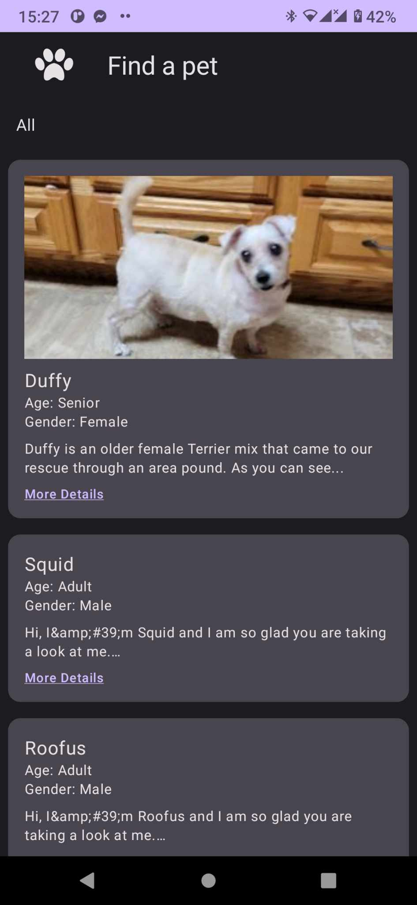

# Projet Mobile

##### Présentation de l'Api
Documentation : https://www.petfinder.com/developers/v2/docs/

Authentification:
POST https://api.petfinder.com/v2/oauth2/token
Body client_secret, client_id, grant_type ="client_credentials"

Liste des animaux
POST https://api.petfinder.com/v2/animals
Query page, limit, type

Liste des types
GET https://api.petfinder.com/v2/types

Un seul animal
GET https://api.petfinder.com/v2/animals/{id}

##### Présentation de l'Application
Page d'acceuil:

Page de détails:
