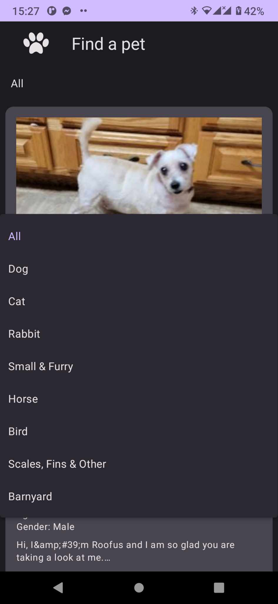
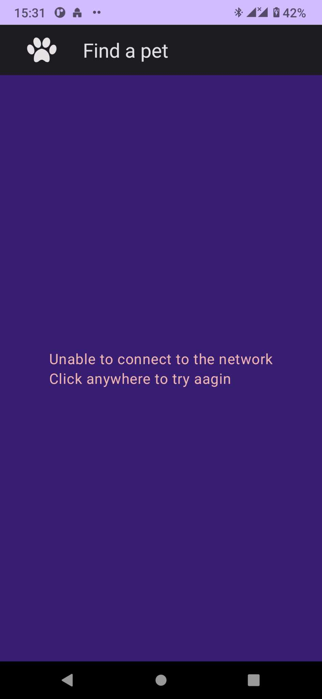
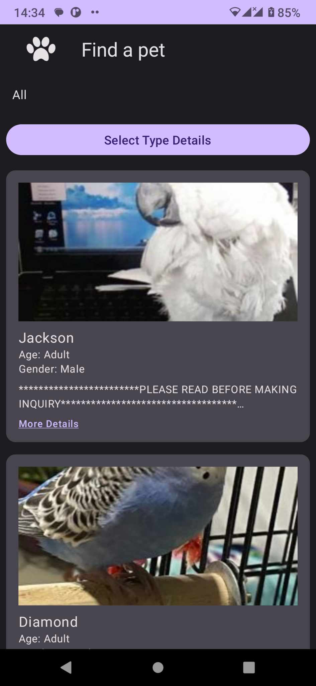
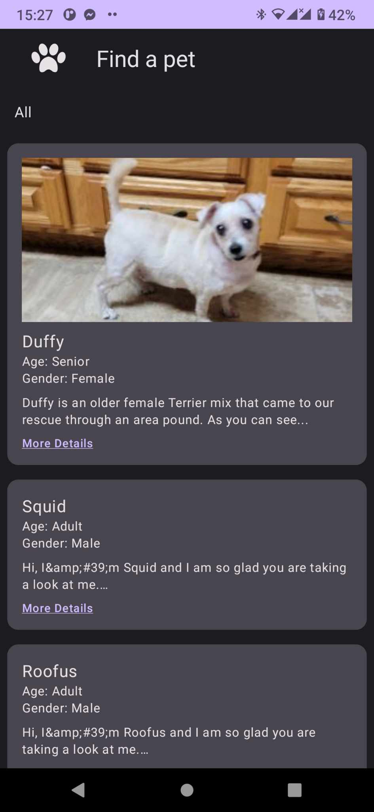
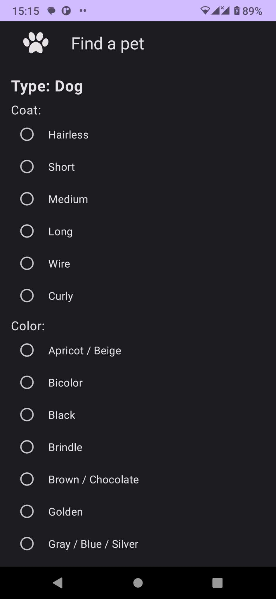
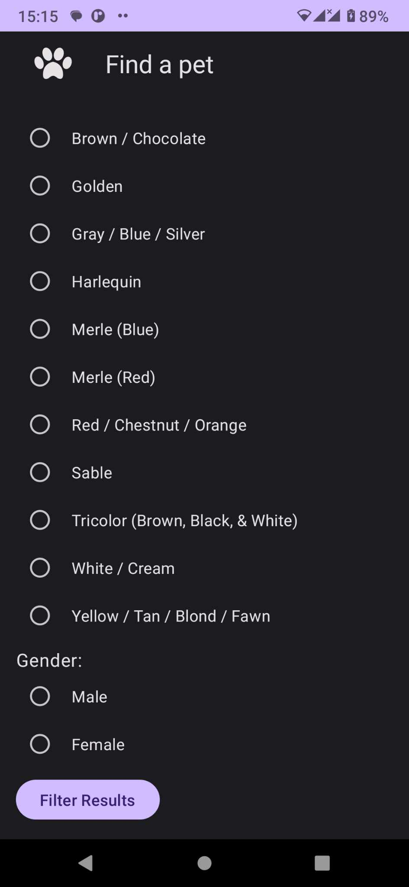

# Projet Mobile

##### Présentation de l'Api
Documentation : https://www.petfinder.com/developers/v2/docs/

Authentification
Prend l'API_KEY et renvoit le token à utiliser avec les autres requêtes
POST https://api.petfinder.com/v2/oauth2/token
Body client_secret, client_id, grant_type ="client_credentials"

Liste des animaux
POST https://api.petfinder.com/v2/animals
Query page, limit, type

Liste des types
GET https://api.petfinder.com/v2/types

Un seul animal
GET https://api.petfinder.com/v2/animals/{id}

##### Fonctionnalités
2 Page pour l'authentification : Page de Login et page de création du compte

Page d'accueil des animaux : Présente tous les animaux disponibles.

Détails de l'animal : Affiche les détails d'un animal lorsqu'on clique sur celui-ci.

Filtrage par type d'animal : Permet de voir les animaux d'un type spécifique.

Détails du type d'animal : Affiche les détails d'un type d'animal spécifique et permet de filtrer les animaux selon les détails du type.

##### Architecture et Conception
Nous avons opté pour l'architecture Modèle-Vue-VueModèle (MVVM) en raison de sa capacité à séparer clairement les responsabilités et exploiter la programmation réactive pour une mise à jour dynamique de l'interface utilisateur. 
En ce qui concerne la conception de l'interface utilisateur, nous avons choisi Jetpack Compose en raison de son approche déclarative, de sa réactivité intégrée, et de son écriture entièrement en Kotlin, offrant ainsi une intégration harmonieuse avec le reste du code Kotlin de l'application. 
Ces choix visent à garantir une architecture robuste, testable et moderne pour le développement d'applications d'adoption d'animaux domestiques.

Pour la partie authentification on a opté pour l'utilisation du realtime database avec Firebase : voilà la liste des utilisateurs qui ont créés des comptes 

##### Présentation de l'Application

Page de Login  : 

Page de Création du compte  : 

Page d'acceuil:

Après selection d'un type

Page de détails:

Page détails du type:

